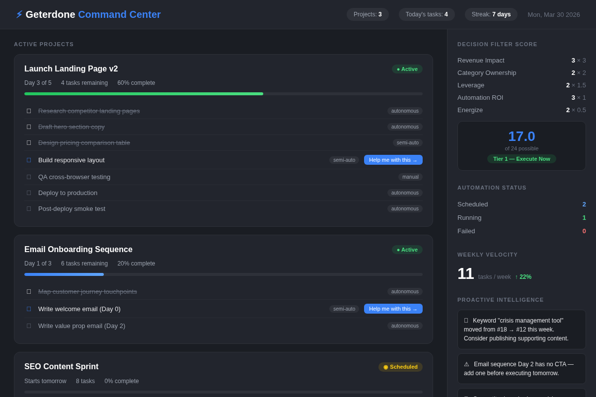

# ⚡ Geterdone

An autonomous project execution engine for [Claude Cowork](https://claude.com). Turns Claude into a persistent execution partner that plans your projects, runs tasks on schedule, tracks progress across sessions, and surfaces blind spots — so you stop context-switching and start shipping.

**Built by [Jay Rockliffe](mailto:jayrockliffe@gmail.com)** while building [Defusely](https://defusely.com) — a Reddit Crisis Response SaaS platform.

---

## Dashboard preview



*The `/status` command renders a fully interactive dashboard — clickable project cards, decision filter scores, automation status, velocity tracking, and proactive intelligence. No network calls. Works offline. Click any task to get Claude's help executing it.*

---

## How is this different from Cowork or Projects?

| | **Claude Cowork** | **Claude Projects** | **Geterdone** |
|---|---|---|---|
| **Memory** | Resets each session | Knowledge base only | Persistent project state across sessions |
| **Execution** | You drive every task | You drive every task | Autonomous — Claude picks up today's work and does it |
| **Planning** | No built-in planning | No built-in planning | Day-by-day execution plans with calendar-aware scheduling |
| **Prioritization** | You decide | You decide | Revenue-weighted decision filters score every project (0–24) |
| **Tracking** | Manual | Manual | Auto-updated progress, velocity metrics, completion rates |
| **QA** | You verify | You verify | Built-in QA gates verify every autonomous output |
| **Intelligence** | Reactive | Reactive | Proactive — surfaces SEO changes, competitive moves, blind spots |
| **Scheduling** | None | None | Calendar-aware with daily/weekly caps and deep work blocks |
| **Dashboard** | None | None | Interactive HTML with clickable task cards |

**The short version:** Cowork is a powerful single-session tool. Geterdone adds the persistent layer — so your projects survive between sessions, execute autonomously or semi-automatically, and get smarter over time.

---

## Quick start

1. **Install**: Drag `geterdone.plugin` into your Cowork window (or install from the Plugin Directory)
2. **Run `/setup`**: Geterdone scans your connected tools, recommends additions, and generates your config. Takes 2 minutes.
3. **Run `/new-project`**: Describe your goal. Geterdone handles the rest.
4. **NOTE** You can ask your Claude to evaluate the Geterdone plug-in (or any plugin or skill) and suggest enhancements based on your chat history and what Claude knows about you. 

---

## Commands

| Command | What it does |
|---------|-------------|
| `/setup` | One-time onboarding. Discovers your tools, recommends connectors, and builds your config file. |
| `/new-project` | Describe a goal → get a triaged, scored, day-by-day execution plan |
| `/execute` | Runs today's tasks autonomously. QA gates verify output. Memory gets updated. |
| `/status` | Interactive dashboard — clickable cards, progress bars, intelligence tab |
| `/update` | Manual override — pause, resume, block, adjust plans, add days |
| `/review` | Progress analysis — velocity, completion rates, cross-project patterns |
| `/done` | Mark a manual or semi-auto task complete after you finish the work |
| `/intel` | On-demand intelligence — SEO changes, competitive signals, blind spots |

---

## What it does (the core loop)

```EXAMPLE
You: "/new-project Launch a new landing page"

Geterdone:
  1. Classifies: multi-day project (not a quick task)
  2. Scores: Revenue 3 × Category 2 × Leverage 2 × Automation 3 × Energize 2 = 17.0/24 → Tier 1
  3. Generates: 5-day execution plan with 12 tasks
  4. Classifies each task: autonomous / semi-auto / manual
  5. Checks your calendar: avoids meeting-heavy days
  6. Schedules: automated daily execution at 9 AM
  7. Saves: persistent JSON + memory graph

Next morning:
  Geterdone auto-executes Day 1 tasks → runs QA → updates memory → dispatches summary to your phone

You: "/status"
  → See the dashboard above. Click any task. Get help.
```

---

## Getting more out of Geterdone

### Build a profitability analysis

One of the most powerful things you can do is add product context to your config. Here's what we run for Defusely:

```json
{
  "product": {
    "name": "Defusely",
    "north_star": "Become category king of Reddit Crisis Response. $5K MRR.",
    "current_mrr": 0,
    "milestones": [
      { "target": "$1K MRR", "deadline": "2026-06-30" },
      { "target": "$5K MRR", "deadline": "2026-12-31" }
    ],
    "workstreams": [
      "Product Development",
      "SEO & AI Search Domination",
      "Founding Partner Outreach",
      "Marketing & Category Positioning"
    ]
  }
}
```

With this context, every `/new-project` runs a **profitability check** before building:

- **LTV impact** — will this project increase customer lifetime value?
- **CAC impact** — will this reduce customer acquisition cost?
- **Revenue if built vs skipped** — what's the dollar cost of not doing this?
- **Expansion trigger** — does this unlock upsell opportunities?

Projects that fail the profitability check get flagged before you waste time on them.

### Customize decision filters for your business

The default filters are revenue-weighted (built for a SaaS founder). You can change them:

| Filter | Default weight | What it measures |
|--------|---------------|-----------------|
| Revenue Impact | 3× | Does this directly drive revenue? |
| Category Ownership | 2× | Does this reinforce your market position? |
| Leverage | 1.5× | Does the output keep working after you stop? |
| Automation ROI | 1× | Can Geterdone execute this autonomously? |
| Energize | 0.5× | Does this energize you? (tiebreaker) |

**For a content creator**: Weight "Audience Growth" at 3× instead of "Revenue Impact."
**For enterprise**: Add "Stakeholder Alignment" as a new dimension.
**For agencies**: Weight "Client Retention" and "Utilization Rate" highest.

Edit `skills/new-project/references/decision-filters.md` to customize.

### Build project templates

Templates give Geterdone pre-built phase structures. Examples:

- **SaaS Feature Launch**: Research → Design → Build → QA → Deploy → Monitor
- **Content Sprint**: Keyword research → Outline → Draft → Edit → Publish → Distribute
- **Outreach Campaign**: List build → Personalize → Send → Follow up → Track

Edit `skills/new-project/references/templates.md` to add yours.

### Wire up integrations

Geterdone's execute skill can talk to any MCP tool you have connected. Some ideas:

- **Ahrefs** — SEO keyword tracking, competitor monitoring
- **Sentry** — error monitoring post-deploy
- **Cloudflare** — deploy pipeline
- **Apollo** — outreach enrichment
- **Gmail** — dispatch summaries
- **Google Calendar** — scheduling awareness
- **Notion** — persistent memory backup
- **Supabase** — database operations
- **Linear** — issue tracking sync
- **Slack** — team notifications

Add your own (or ask Claude to do it for you) in `skills/execute/references/integrations/`.

### Set your schedule

Edit `skills/new-project/references/calendar-aware.md`:

- **Weekly cap**: Total project hours (default: 15 for half-time, set to 35+ for full-time)
- **Daily cap**: Max % of free time to schedule (default: 60%)
- **Deep work blocks**: When you do focused work (mornings, evenings, etc.)

---

## Architecture

```
geterdone/
├── skills/
│   ├── setup/          # One-time onboarding + tool discovery
│   ├── new-project/    # Smart triage + day-by-day planning
│   ├── execute/        # Autonomous execution engine
│   ├── status/         # Interactive HTML dashboard
│   ├── update/         # Manual project overrides
│   ├── review/         # Progress analysis + intelligence
│   ├── done/           # Manual task completion
│   └── intel/          # Proactive intelligence engine
├── dashboard-preview.png
├── README.md
└── LICENSE
```

### Three-tier task classification

- **Autonomous** — Claude executes fully (research, drafting, deploys, data processing)
- **Semi-auto** — Claude prepares everything, you review and approve
- **Manual** — You do the work, Geterdone tracks and nudges

### QA gates

Every autonomous execution runs verification. Content gets word count and placeholder checks. Code gets test runs. Web deliverables get browser testing. Deploys get error monitoring. Nothing is marked done without proof.

### Memory protocol

Every action writes to persistent memory (basic-memory, memory graph, optionally Notion). Context survives across sessions. This is how Geterdone remembers where you left off.

### Lazy loading

Each skill's SKILL.md is lean (<800 words) and loads reference files on demand. This keeps token usage low and scales to dozens of integrations without burning context.

---

## Why we built this

Geterdone started as an internal tool for [Defusely](https://defusely.com). As a solo founder working half-time across four workstreams, I needed Claude to remember context between sessions and execute autonomously when possible.

Cowork is powerful but stateless. Every new session starts from zero. When you're running multi-day projects — feature launches, SEO sprints, outreach campaigns — that reset is painful. Geterdone adds the persistent layer.

The revenue-weighted decision filters exist because when you're pre-revenue, everything feels urgent. Scoring projects on a 0–24 scale with revenue weighted at 3× forces honest prioritization. It's the difference between shipping what matters and staying busy.

---

## Need help customizing?

If you want help adapting Geterdone for your workflows — custom decision filters, project templates, integration wiring, profitability analysis — I offer consulting, but only for companies that help humans. I won't work for spirits, Pharma, and most CPGs.

**Book a call**: [jayrockliffe@gmail.com](mailto:jayrockliffe@gmail.com)

Built while building [Defusely](https://defusely.com) — Reddit Crisis Response for PR agencies and corporate comms teams. If your brand has ever had a Reddit problem, [check us out](https://defusely.com).

---

## Contributing

PRs welcome. Key principles:

- No network calls in the dashboard (keep it offline)
- System fonts only (no CDN dependencies)
- Lazy loading (reference files loaded on demand)
- Memory updates are mandatory (every action must persist)
- Three-tier task classification (autonomous, semi-auto, manual)

---

## License

Apache 2.0 — see [LICENSE](LICENSE) for details.

